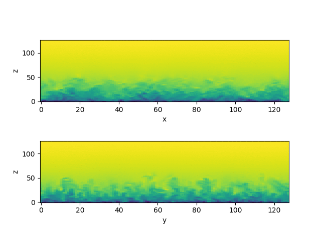

## WireLES2
@author: Mou Lin (mou.lin@epfl.ch),Tristan Revaz(tristan.revaz@epfl.ch)


### Introduction
WireLES2 is a large-eddy simulation code written in CUDA Fortran for simulating atmospheric boundary layer flows. It solves the filtered continuity equation and the filtered Navier-Stokes equations (using the Boussinesq approximation). The numerical method used in this code is based on the PhD thesis of Albertson, 1996 [1] (attached in doc/theory).

Its main features can be summarized as follows: It uses a second-order Adams–Bashforth explicit scheme for time advancement and a hybrid pseudospectral finite-difference scheme for the spatial discretization. The lateral boundary conditions are periodic. The top boundary condition is set up as a flux-free condition. The bottom boundary condition requires the calculation of the instantaneous surface shear stress, which is accomplished through the local application of Monin–Obukhov similarity theory. The SGS fluxes of momentum are parameterized using Lagrangian scale-dependent dynamic models [2]. 

### Code structure:


```bash
WireLES2/
├── doc (documentation dir)
├── job (simulation job dir)
│   └── [job1_name] 
│       ├── input (contains config file)
│       └── src (copied and compiled src dir)
│	└── [job2_name]
│	└── ...
├── prc (preprocessing python script dir)
└── src (CUDA Fortran code dir)
```
### How to run
Run the following line in the terminal first or add it in ~/.bashrc :
```bash
alias wireles='python prc/wireles.py'
```
then you can run various of application with the line
```bash
wireles [applications name] [case name]
```
applications list:
- create: create case with dummy default file
- remove: remove case completely
- clean: remove all files except input/config
- edit: edit config file
- pre: pre-process case
- solve: submit case to the cluster through the slurm 
- debug: run the case on the local machine or cluster interactive debug mode
- make: compile the case
- post: quick build-in post processing of the simulation data
- anime: produce an animation of the flow from instant fields output
- h5gen: generating self-explained hdf5 file of the simulation data for customized postprocessing

A simple workflow: create --> edit --> pre --> solve/debug --> post/anime
 
To make life easier, a bash script *test_run.sh* has been provided to allow the new user to run a example case easily. 

   
### Reference
   [1] Albertson, J.D., 1996. Large eddy simulation of land-atmosphere interaction. University of California, Davis.
   
   [2] Bou-Zeid, E., Meneveau, C. and Parlange, M., 2005. A scale-dependent Lagrangian dynamic model for large eddy simulation of complex turbulent flows. Physics of fluids, 17(2), p.025105.


